# Entra ID MFA Security Lab

A cloud identity administration lab built in a Microsoft Entra ID tenant. Working the way an MSP would on day one with a new client, I provisioned users into role-based security groups, assigned licenses, enforced multi-factor authentication through Conditional Access, enabled self-service password reset, stood up an emergency break-glass admin account, and delegated helpdesk permissions using least privilege — then validated that the permission boundaries actually hold, and closed the project with a full compromised-account incident response.

This is the cloud-identity companion to my [on-prem Active Directory helpdesk lab](https://github.com/tijoenyl/helpdesk-simulation-lab).

## Tenant and Users

- **Tenant:** Lainecorp
- **Users:** 6 users provisioned across three departments

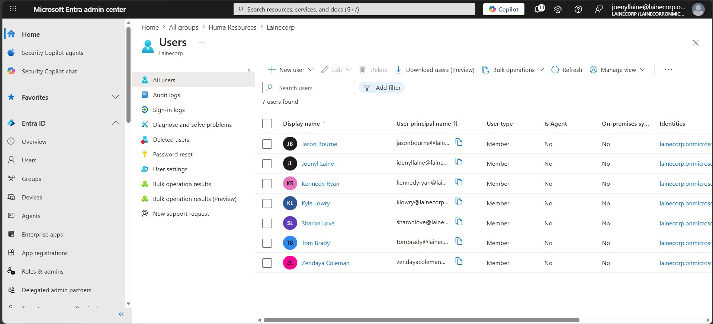

I organized the users into three security groups by department: **Information Technology** (Tom Brady, Zendaya Coleman), **Sales** (Jason Bourne, Kyle Lowry), and **Human Resources** (Kennedy Ryan, Sharon Love).

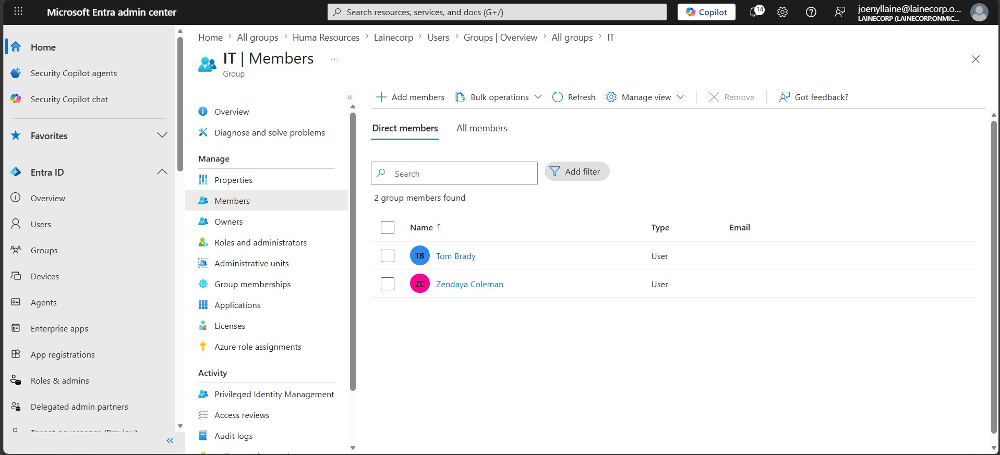

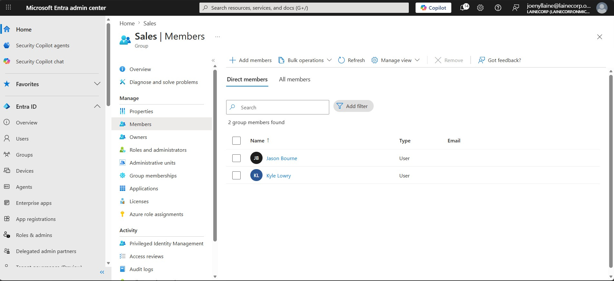

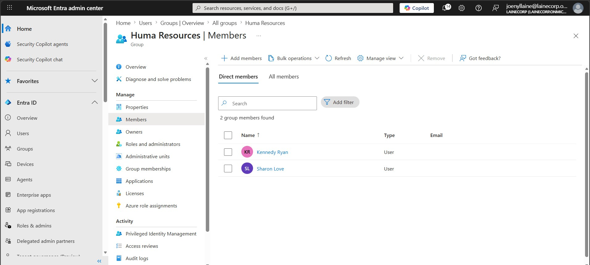

## Licensing

I assigned Office 365 E5 and Enterprise Mobility + Security E5 licenses so the tenant would have access to Conditional Access and the rest of the premium identity features. On the products page you can see both E5 subscriptions active on the tenant, along with Microsoft Entra ID Free.

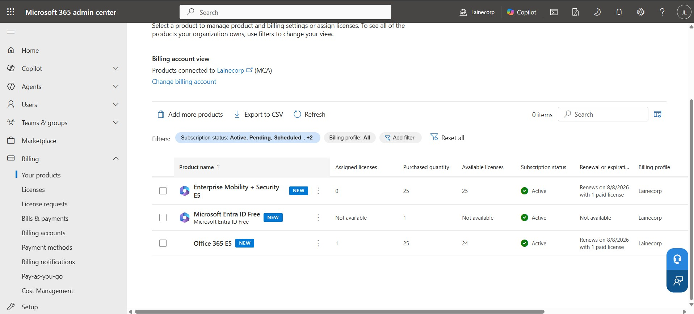

Group-based license assignment is no longer supported from the Entra portal, so I did the assignment through the Microsoft 365 admin center instead — assigning the Enterprise Mobility + Security E5 licenses to the IT, Sales, and Human Resources groups.

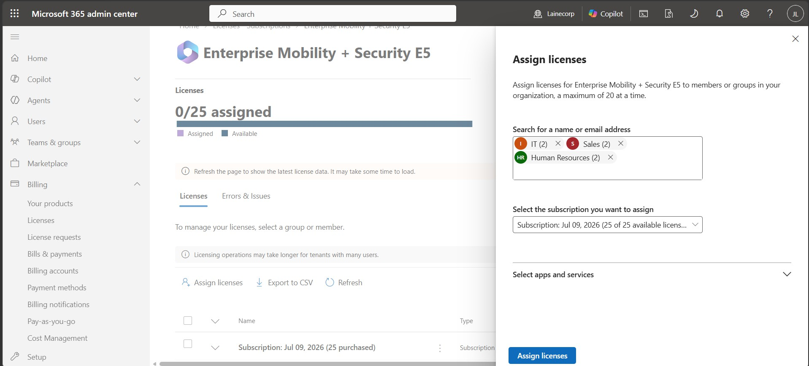

## Multi-Factor Authentication (Conditional Access)

An absolute essential — I enforced MFA immediately through a Conditional Access policy. Multi-factor authentication is table stakes for any organization.

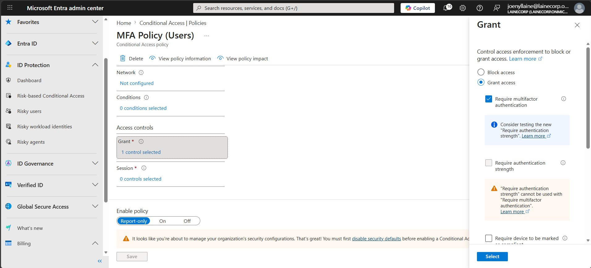

## Break-Glass Admin Account

I stood up a break-glass admin account that is excluded from the Conditional Access policies, so there's always an emergency path into the tenant if MFA or Conditional Access ever locks everyone out. Break-glass accounts are a staple across the IT industry.

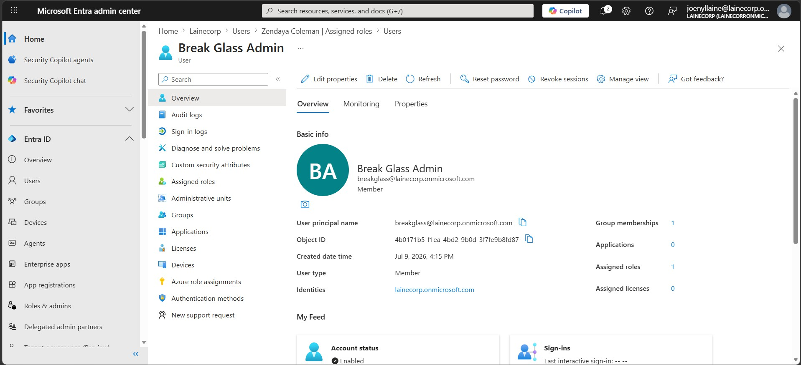

## Self-Service Password Reset

I enabled self-service password reset for all users so they can securely reset forgotten passwords without a helpdesk ticket.

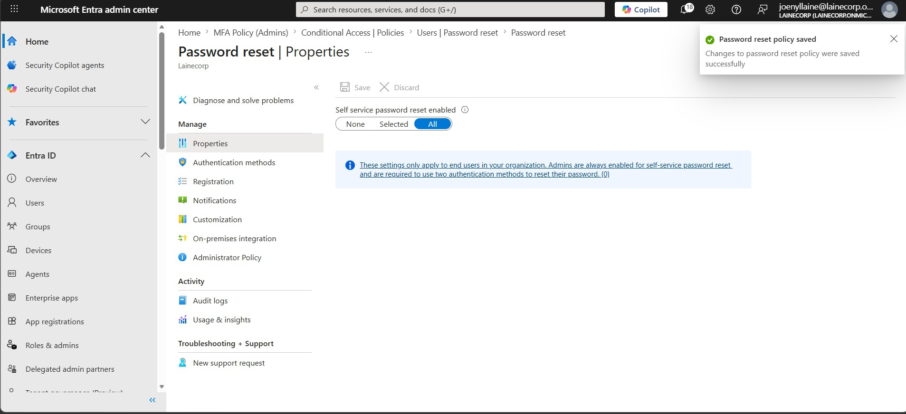

I then configured the authentication methods, requiring **two methods** to complete a reset — so a single compromised factor isn't enough to take over an account.

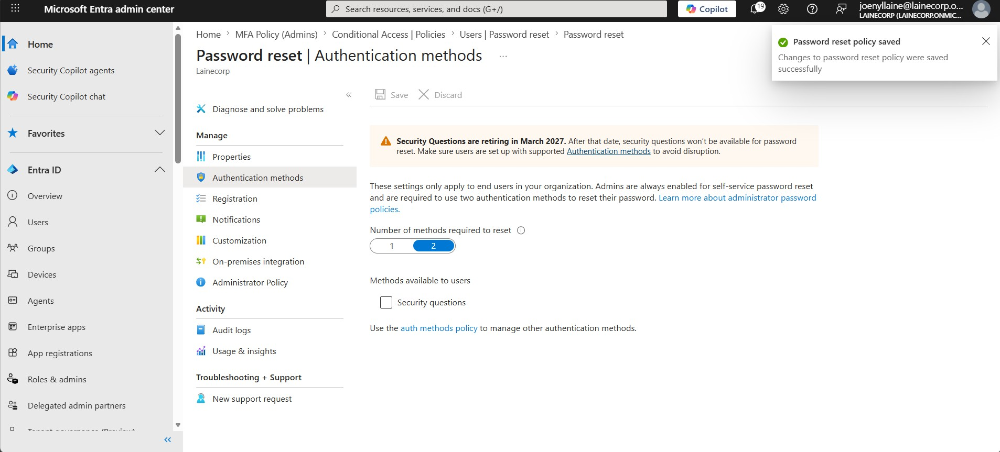

## Delegating Helpdesk Permissions (Least Privilege)

I assigned Zendaya Coleman the **Helpdesk Administrator** role, giving her the privilege to make small changes within the tenant and troubleshoot low-level issues such as password resets — and nothing more.

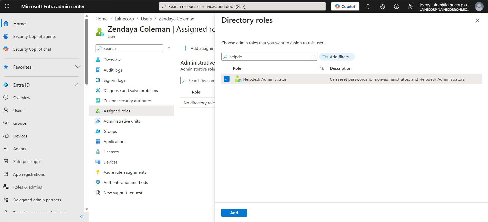

## Validating the Delegated Role

To prove the delegation actually worked, I signed in as Zendaya and reset Kyle Lowry's password from his user Overview toolbar. This is the directory-role path her Helpdesk Administrator role covers, and it succeeded — the portal returned "Password has been reset" and generated a temporary password.

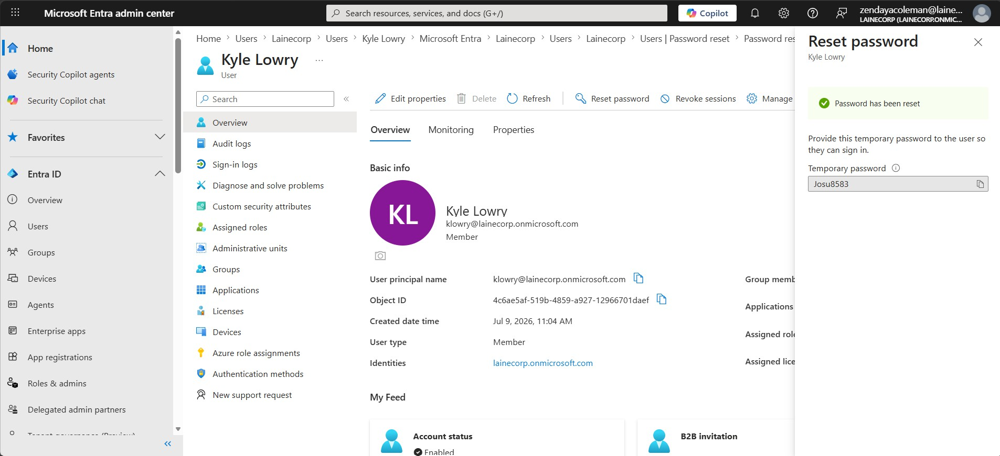

Then, while still signed in as Zendaya, I tried the same reset from the standalone Password reset blade and got a **401 "You don't have access"** error. That blade is an Azure resource-scoped surface, and her directory role doesn't grant access to it. Rather than an error to fix, this is empirical evidence of least privilege working — the permission boundary held exactly where it should. Zendaya can do the helpdesk job she was delegated, and nothing beyond it.

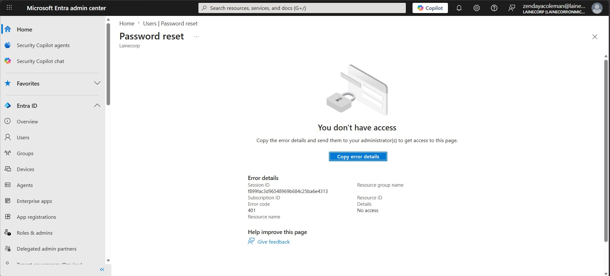

## Incident Response — Compromised Account

To close the project I ran through how I'd respond if an account were compromised, using Kyle Lowry (klowry) as the affected user. I started from the All users list with Kyle selected as the account to act on.

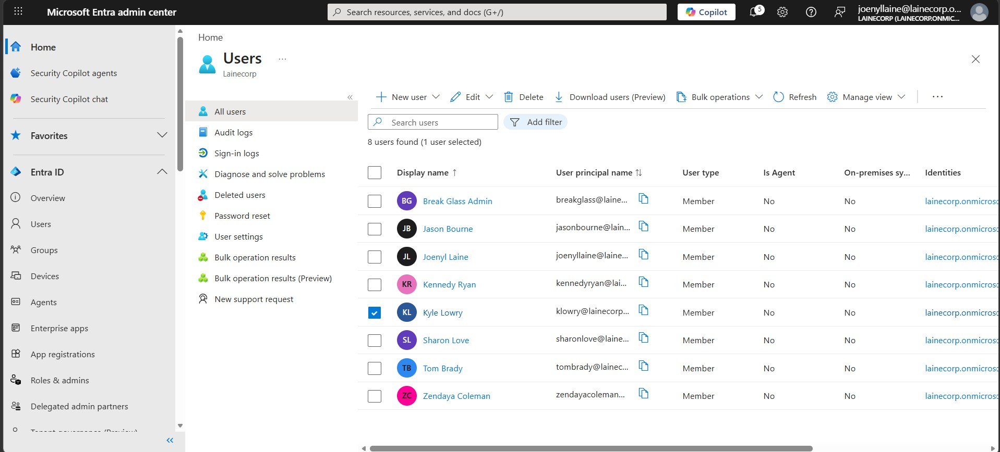

**1. Contain — disable the account.** The first thing I did was disable his account to stop any active use, by unchecking "Account enabled" in his properties.

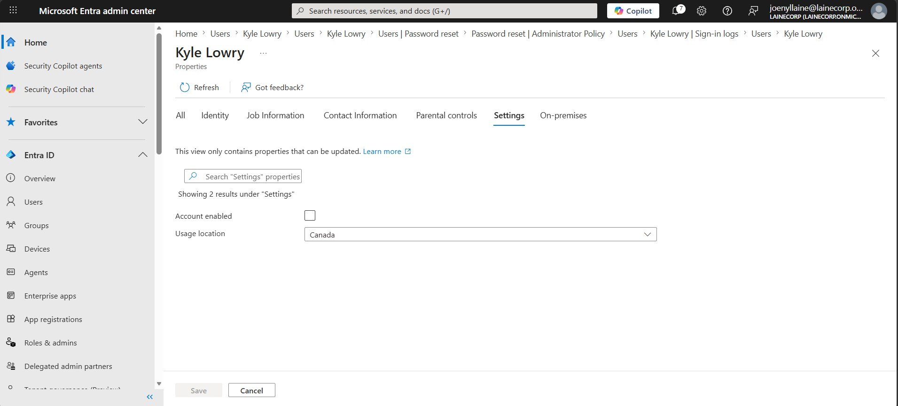

**2. Contain — revoke sessions.** Next I revoked his sessions, which forces any stolen token to stop working immediately and requires a fresh sign-in from every device. His account now shows as Disabled.

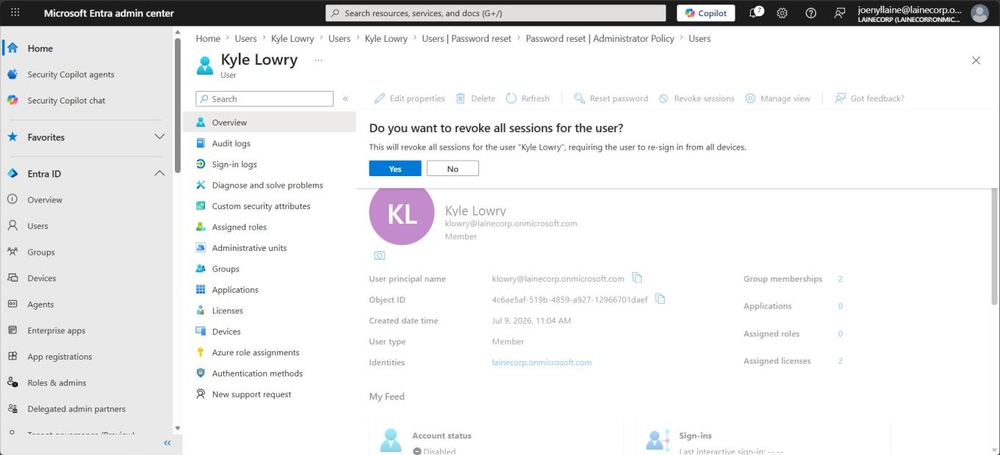

From Kyle's side, any attempt to sign in now shows that his account has been locked and to contact support — confirming the containment took effect on the end-user experience.

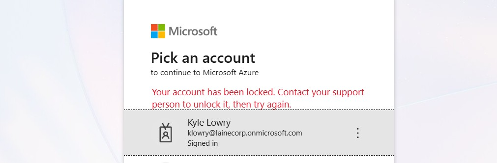

**3. Investigate — sign-in logs.** With the account contained, I went into Kyle's sign-in logs to investigate the activity. The recent interactive sign-ins show failures with error code 500571 after the account was disabled, alongside a handful of interrupted sign-ins.

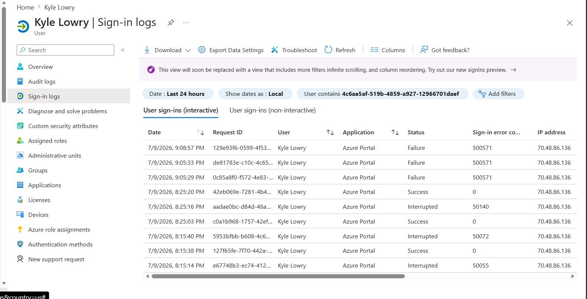

**4. Eradicate — force MFA re-registration.** Once I'd investigated, I required Kyle to re-register for MFA. This deactivates his existing authentication methods — phone numbers, Microsoft Authenticator, and OATH tokens — so an attacker can't reuse any method that may have been registered during the compromise.

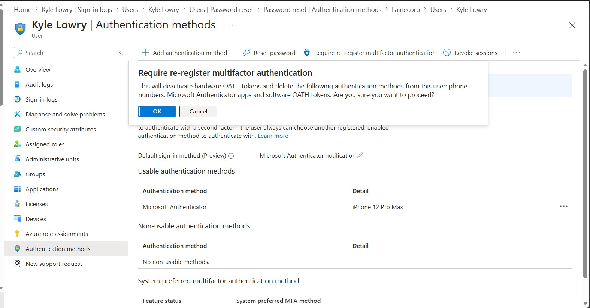

**5. Recover — restore access safely.** After re-enabling the account and resetting the password, Kyle signs back in and is prompted to verify his identity before accessing sensitive info, then re-registers with Microsoft Authenticator via QR code.

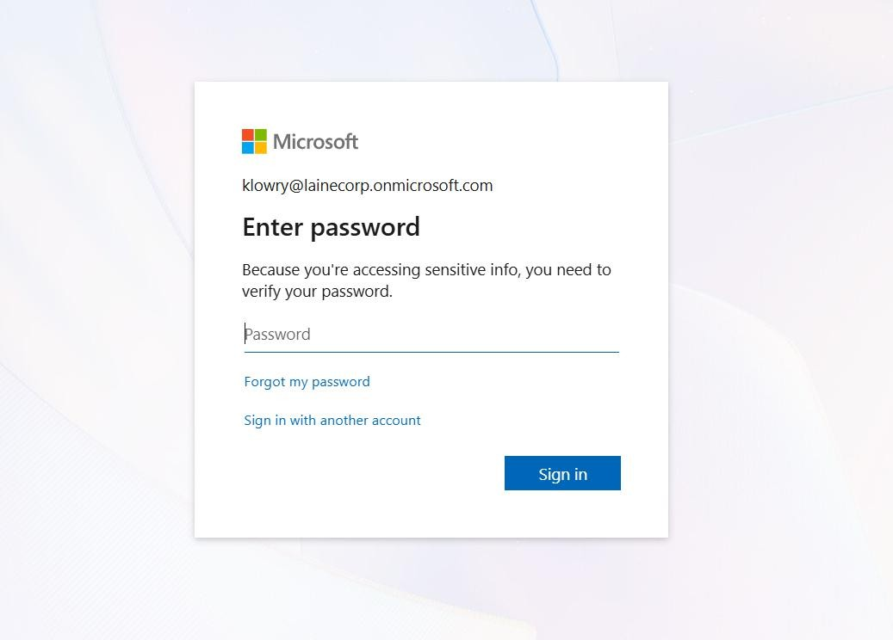

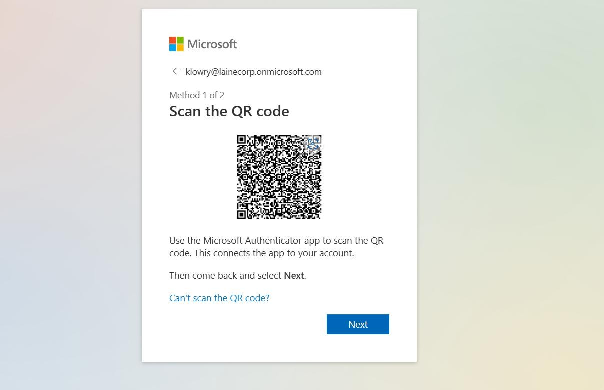

## Skills demonstrated

- Microsoft Entra ID tenant administration: user provisioning, security groups, role-based organization
- License management (O365 E5 / EMS E5), including group-based assignment via the Microsoft 365 admin center
- Conditional Access policy design for MFA enforcement, with break-glass exclusions
- Self-service password reset configuration with multi-method requirements
- RBAC and least-privilege delegation (Helpdesk Administrator), validated empirically at the permission boundary
- Incident response for a compromised account: containment (disable + revoke sessions), investigation (sign-in logs), eradication (MFA re-registration), and safe recovery
